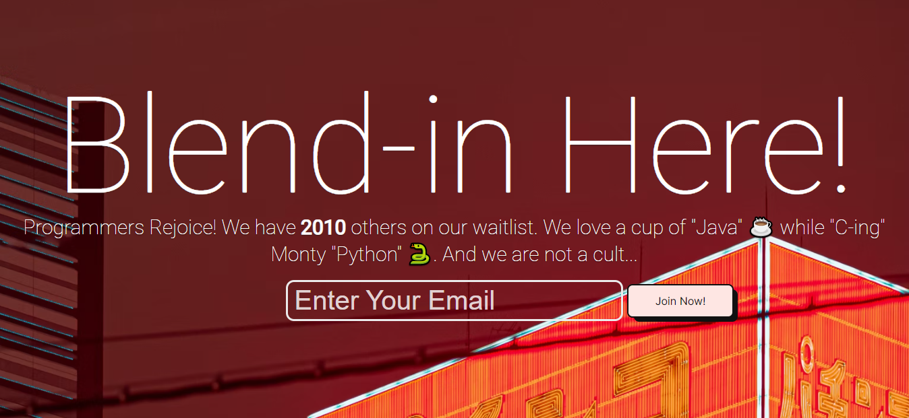

# blendin-mailing-list



## Installation and Running the Project
1. Download or Clone the Zip file.
2. Run ```  npm install ``` in the terminal to get all the dependencies listed in the package.json file.
3. The query is already there in the app.js file in the main directory.
4. Go inside the blend_list directory or Run ``` cd blend_list/ ```.
5. Run ``` node app.js ``` in the terminal. The server should be running at port 3000.
6. From here on, you can play around with the styling and make it your own.

**NOTE: I used the cloud based Goorm IDE for this Project. But it should not be a problem in connecting NodeJS in MySQL Workbench either.**

### Project Description
A bare-bones web-app designed using MySQL, NodeJS, ExpressJS, FakerJS and some vanilla HTML and CSS.
This is a simple mailing list that stores emails generated through an SQL query utilizing FakerJS framework. 
It's a popular framework to use when you need to generate massive amount of fake data. When the app is running on the server, it's going to store the email generated dynamically
on the web page and update the number of people on the waitlist.

### Reasons for using the technologies above
I wanted to build something using MySQL and NodeJS because I never really created a good project using them so I thought this would be a good project to learn a lot of new things
and establish a working, if not advanced enough knowledge in these technologies. The practice with Javascript and CSS styling was a cherry on top.

### Challenges Faced
I had to research a bit to learn about FakerJS because it was having some problems running it thorugh Node. Also, I had to refer to ExpressJS docs quite a bit, but it was good to go
through them, they were well explained and easy to navigate.

### Resources and Materials 
1. [ExpressJS Docs](https://expressjs.com/)
2. [FakerJS](https://github.com/faker-js/faker)
3. [MDN Web Docs](https://developer.mozilla.org/en-US/)
4. [MySQL Docs](https://dev.mysql.com/doc/)
